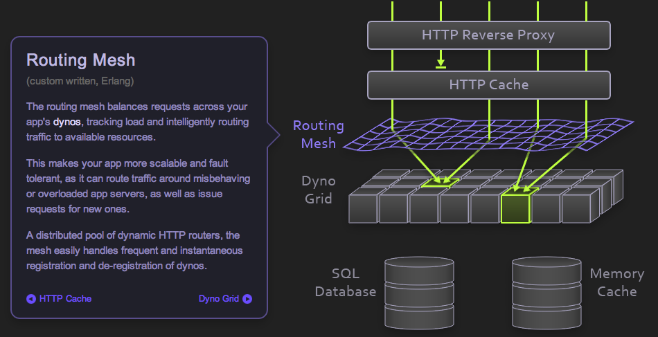

!SLIDE title-slide center bullets

# Utilizing Redis in distributed Erlang systems #

* jkvor.com/erlang-factory-london

!SLIDE center smbullets incremental transition=scrollUp

# Jacob Vorreuter and Orion Henry #

* Heroku is a platform composed of heterogeneous components
* Ruby, Erlang, Go
* Components must communicate and share information

!SLIDE center smbullets incremental transition=scrollUp

* Written in C
* Single threaded
* Non-blocking, evented I/O
* Requires no external dependencies
* Supports data types such as lists, sets and hashes
* Persistence is available via async writes to disk
* Master/slave replication
* Pub/Sub capabilities

!SLIDE smbullets incremental transition=scrollUp

# How Heroku uses Redis #

* As an ephemeral registry of instance health and availability
* As a redundant cache of shared state data
* As a destination for capped collections of log data
* As a pub/sub channel used to generate real-time usage graphs

!SLIDE center transition=scrollUp

# Tools and examples #

!SLIDE center smbullets transition=scrollUp

# github.com/JacobVorreuter/redgrid #

* Automatic Erlang node discovery via Redis

!SLIDE center transition=scrollUp

!SLIDE center transition=scrollUp

!SLIDE transition=scrollUp small

# Attaching meta data to nodes #

	1> node().
	'foo@blah'
	2> redgrid:update_meta([{weight, 0}]).
	ok

	1> node().
	'bar@wha'
	2> redgrid:nodes().
	[{'bar@wha',  [{ip, "10.0.0.2"}]},
	 {'foo@blah', [{ip, "10.0.0.1"},
	               {weight, 0}]}]

!SLIDE center smbullets transition=scrollUp

# github.com/JacobVorreuter/redo #

* pipelined erlang redis client 

!SLIDE transition=scrollUp small

# Simple, pipelined, no sugar #

        1> redo:start_link().
        {ok,<0.33.0>}

        2> redo:cmd(["SET", "one", "abc"]).
        <<"OK">>

        3> redo:cmd(["SET", "two", "def"]).
        <<"OK">>

        4> redo:cmd([["GET", "one"],
                     ["GET", "two"]]).
        [<<"abc">>,<<"def">>]

!SLIDE transition=scrollUp

# Fast #

        1> bench:sync(1000).
        91ms
        10989 req/sec

        2> bench:sync(10000).
        938ms
        10752 req/sec
 
!SLIDE transition=scrollUp

# Faster #

        1> bench:async(1000, 100).
        38ms
        26315 req/sec

        2> bench:async(10000, 1000).
        294ms
        34482 req/sec

        3> bench:async(34000, 1500).
        1092ms
        31250 req/sec

!SLIDE center transition=scrollUp

# An example of Redis at Heroku #

!SLIDE center transition=scrollUp

# Erlang routing mesh #

!SLIDE center transition=scrollUp

# Redis as a redundant cache of shared state #

!SLIDE smbullets transition=scrollUp

# One limitation of Redis replication #

* There is a period during slave resync when neither the old or new dataset is available
* Disconnecting from master due to master failure or network hiccup causes slave downtime

!SLIDE transition=scrollUp smaller

        - Reading from client: Connection reset by peer
        * Connecting to MASTER...
        * MASTER <-> SLAVE sync started: SYNC sent
        * MASTER <-> SLAVE sync: receiving 66055964 bytes from master
        * MASTER <-> SLAVE sync: Loading DB in memory
        * MASTER <-> SLAVE sync: Finished with success

!SLIDE transition=scrollUp small

        00:24:57: CONFIG SET MASTERAUTH password
        00:24:57: OK
        00:24:57: STATUS: master_link_status:down
        00:24:57: waiting for master_link_status:up
        ...
        00:25:08: STATUS: master_link_status:up
        00:25:08: CONFIG SET MASTERAUTH NULL
        00:25:08: OK
        
!SLIDE center smbullets transition=scrollUp

# github.com/JacobVorreuter/nsync

* Erlang Redis replication client

!SLIDE center smbullets transition=scrollUp

# github.com/JacobVorreuter/tempo #

* Node.js websocket interface to Redis pub/sub channels

